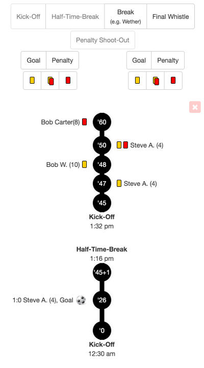

[](http://github.com/syl20bnr/spacemacs)

# Soccer Match Timeline

A vertical timeline creator to display events of a soccer match with HTML/CSS/JavaScript. 

It's a subproject of my [club homepage](https://github.com/the-guitarman/club_homepage) project. The intension is to send all match events to all connected clients via websockets from the playing field directly and to display them as a timeline. Nice benefit: This way other imprecise messenger communication becomes useless.

## Dependencies

- jQuery
- Twitter Bootstrap (CSS)
- Underscore.js
- Moment.js with locales

## Example



## Usage

To use the timeline creator remove the example data tag (`<script src="lib/example-data.js"></script>`) at first.

## Match Character

If your match may be undecided after 90 minutes and then it would need some extra time and a penalty shoot-out so set the `data-match-character` attribute of the `match-timeline` element to `deciding-game` within the `index.html` file.

## Events

There are three events fired for the `match-timeline` element while adding a new match event.

```
$('#match-timeline').on('match-event:add', function(event, matchEvent){
  console.log('match-event:added', event, matchEvent);
});
$('#match-timeline').on('match-event:beforeAdd', function(event, newMatchEvent, allMatchEvents){
  console.log('match-event:added', event, newMatchEvent, allMatchEvents);
});
$('#match-timeline').on('match-event:afterAdd', function(event, newMatchEvent, allMatchEvents){
  console.log('match-event:added', event, newMatchEvent, allMatchEvents);
});
```

There are three events fired for the `match-timeline` element while removing the newest match event.

```
$('#match-timeline').on('match-event:remove', function(event, removedMatchEventIndex){
  console.log('match-event:removed', event, removedMatchEventIndex);
});
$('#match-timeline').on('match-event:beforeRemove', function(event, oldMatchEventIndex, oldMatchEvent, allMatchEvents){
  console.log('match-event:removed', event, oldMatchEvent, allMatchEvents);
});
$('#match-timeline').on('match-event:afterRemove', function(event, oldMatchEventIndex, oldMatchEvent, allMatchEvents){
  console.log('match-event:removed', event, oldMatchEvent, allMatchEvents);
});
```

## Languages

At the moment there are two languages:

- `en`: English (default)
- `de`: German

To select a language set the `data-language` attribute of the `match-timeline` element within the `index.html` file.

Feel free to add more translations.

## License

This project has a dual license.

This package is licensed under the **LGPL 3.0**. Do whatever you want with it, but please give improvements and bugfixes back so everyone can benefit.

For commercial usage please contact me at first.

*Note:* Everything may break at every time.